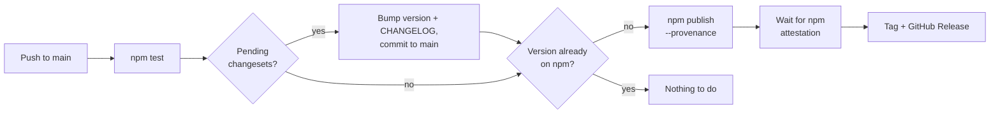

# Contributing

## Adding a logo

1. Create `logos/<scope>/<id>/`. `<scope>` is a lower-case ISO country code (`ng`, `gh`) or `global`. `<id>` is a kebab-case slug that is not already used anywhere in `logos/`.
2. Add `logo.svg` (the full logo). Optionally add `mark.svg` (the icon only), but only when the brand publishes one. Don't crop or recolour logos yourself.
3. Add `meta.json`:

```json
{
  "id": "gtbank",
  "name": "Guaranty Trust Bank",
  "shortName": "GTBank",
  "aliases": ["GTB", "Guaranty Trust"],
  "scope": "NG",
  "markets": ["NG"],
  "types": ["bank"],
  "variants": ["logo"],
  "colors": { "primary": "#FF4713" },
  "website": "https://www.gtbank.com",
  "regulatorRef": { "body": "CBN", "category": "commercial-bank" },
  "source": { "url": "https://www.gtbank.com", "license": "official-site", "fetchedAt": "2026-09-24" },
  "verified": false,
  "addedIn": "0.1.0"
}
```

If `mark.svg` comes from a different place than `logo.svg`, record where in `variantSources`:

```json
"variantSources": {
  "mark": { "url": "https://moniepoint.com/icon.svg", "license": "official-site", "fetchedAt": "2026-09-24" }
}
```

4. Run `npm run normalize && npm run validate`, then `npm run preview` to check how the logo looks on light and dark backgrounds and at 32px.

Always set `verified: false`. A maintainer changes it to `true` after reviewing the logo.

## Sources, in order of preference

| `source.license`         | Use when                                                 |
| ------------------------ | -------------------------------------------------------- |
| `official-press-kit`     | The brand publishes a media or press kit                 |
| `cc-by-sa`               | Wikimedia Commons file under a free license              |
| `public-domain-textlogo` | Wikimedia Commons file tagged as a simple text logo      |
| `official-site`          | SVG taken from the brand's own website                   |
| `manual`                 | Recreated by hand. Needs extra review before it's merged |

Never trace a raster image. If no clean SVG exists, open a "wanted logo" issue instead.

## File formats

Keep originals lossless: `logo.svg` when the brand publishes a vector, otherwise the official image as `logo.png` (with `"formats": { "logo": "png" }`). The importer converts JPEG/WebP sources to PNG. The package build converts PNGs to WebP; never commit WebP.

## SVG rules (checked by `npm run validate`)

- The root `<svg>` has a valid `viewBox`.
- No `<script>`, `<foreignObject>`, embedded `<image>`, event handlers or external references.
- At most 20 KB after normalizing.

## Releasing

Releases are fully automatic: push a change with a changeset to `main` and GitHub Actions versions it, publishes it to npm with provenance, and tags it. There is no pull request to merge.

### 1. Add a changeset with your change

```bash
npx changeset
```

Pick the bump and write one or two sentences for the changelog:

| Bump      | Use for                                                                     |
| --------- | --------------------------------------------------------------------------- |
| **patch** | Logo fixes, metadata corrections, docs or tooling changes that ship         |
| **minor** | New logos or countries, new API                                             |
| **major** | Breaking API changes, or removing/renaming an entity id (ids are permanent) |

Commit the generated `.changeset/*.md` file with your change and push (or merge) it to `main`. That's it.

### 2. What happens automatically

On every push to `main`, the **Release** workflow (`.github/workflows/release.yml`) runs:



- **With pending changesets**, it runs `npm run version-packages` (bumps `packages/core/package.json`, writes `packages/core/CHANGELOG.md`, deletes the changeset files) and pushes a `Release banklogos@<version>` commit to `main` as `github-actions[bot]`. Pull before your next change.
- **Then, in the same run**, it builds, runs `npm publish --provenance --access public`, waits until npm serves the provenance attestation (npm can take anywhere from a few minutes to over half an hour to list a new version; the run waits up to 60), and creates the `banklogos@<version>` git tag and GitHub Release with the changelog section as notes. If the attestation never appears, the run fails instead of reporting success. Every run also creates the tag and Release for the current version if they're missing, so after a timeout, once the version shows up on npm, **Actions → Release → Run workflow** finishes the job.
- **Without a changeset**, nothing is released. Several changesets pushed together become one release.

There is no review step between pushing and publishing, so only push changesets to `main` when you mean to release. You can also start the workflow by hand from **Actions → Release → Run workflow**; it only publishes a version that isn't on npm yet, so re-running is safe.

### How publishing is authorised

There is no npm token. npm **trusted publishing** trusts this repository's `release.yml` through GitHub's OIDC identity, and the package gets a provenance attestation that links each version to the exact commit and workflow run. One-time setup (already done):

- npmjs.com → `banklogos` → Settings → **Trusted Publisher**: GitHub Actions, `folabas` / `banklogos`, workflow `release.yml`, no environment.
- If you add branch protection to `main`, allow GitHub Actions to push to it (the workflow commits the version bump directly).
- The workflow needs `id-token: write` and npm 11.5.1 or later (it installs it; Node 22 ships npm 10).

Check a release with `npm audit signatures` in any project that installs it: it should report a verified registry signature and a verified attestation.

### If something goes wrong

| Symptom                                                             | Cause and fix                                                                                                                                                                                                                                       |
| ------------------------------------------------------------------- | --------------------------------------------------------------------------------------------------------------------------------------------------------------------------------------------------------------------------------------------------- |
| The Version step fails on `git push` (rejected or protected branch) | Someone pushed to `main` mid-run, or branch protection blocks Actions. Re-run the workflow, or allow Actions to push to `main`.                                                                                                                     |
| Publish fails with an authentication error (`ENEEDAUTH`, 403, OIDC) | The Trusted Publisher on npmjs.com doesn't match: check owner, repo and the workflow **file name** (`release.yml`, not the path).                                                                                                                   |
| "has no provenance attestation on npm"                              | npm is slow to list it. Check `npm view banklogos versions` later; once it's there, **Run workflow** to create the tag and Release. If it's on npm without provenance, it can't be republished: add a patch changeset and release the next version. |

**Manual publish (emergency only).** From `packages/core`, after `npm run build` at the root: `npm publish --provenance=false --access public` (needs `npm login` and your 2FA code). It won't carry provenance, and you must create the tag yourself: `git tag -a banklogos@<version> -m "banklogos <version>"` and `git push origin banklogos@<version>`.
