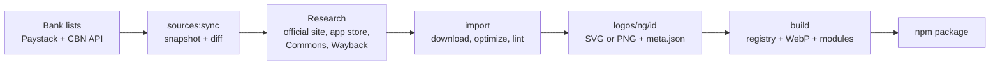

# banklogos: project overview

What the project is, the problem it solves, how it works, the stack, and the decisions behind it (including the alternatives we rejected). Last updated 2026-09-25.

## What it is

`banklogos` is an npm package that gives developers the official logo of every Nigerian bank, microfinance bank, mobile money provider and wallet. Apps can look a logo up by bank code, name or search. The data model and pipeline work for any country, and Nigeria is covered first.

| Measure                       | Today                                                                                                                                                    |
| ----------------------------- | -------------------------------------------------------------------------------------------------------------------------------------------------------- |
| Logos                         | 273 (48 SVG, 225 WebP), plus 184 icon-only marks                                                                                                         |
| Nigerian bank codes covered   | 272 of 279 (97%)                                                                                                                                         |
| CBN-licensed banks covered    | 55 of 56 (98%)                                                                                                                                           |
| Package size                  | 4.1 MB download, 5.1 MB installed                                                                                                                        |
| Size added to an app per logo | about 0.1 KB of code, plus the image file                                                                                                                |
| Status                        | Published on npm (latest 0.1.2, with provenance). 192 logos verified (grade A); 81 graded B/C and marked `verified: false` (see `sources/verification/`) |

## The problem it solves

Every Nigerian fintech app needs bank logos, and no single reliable source exists, so each team rebuilds the same set by hand.

- **Transfer screens need a logo for every bank code.** A transfer API returns a code like `058` or `50515`, and the app has to show the right logo for about 280 institutions. Most of them are small microfinance banks.
- **The logos are scattered.** They sit on bank websites, in app store listings and in the odd press kit. Most banks publish only PNGs, and many small microfinance banks have no website at all.
- **Existing packages are narrow.** They typically cover one country and only big commercial banks. They don't cover microfinance banks, wallets or mobile money, and they don't record where each logo came from.
- **Banks change over time.** They rebrand, merge (Providus and Unity) and lose licenses (Heritage, Kano Poly). A hand-copied logo set goes stale without anyone noticing.

The package gives developers one import that covers every bank code, records where each logo came from, and can be refreshed from the official lists.

## How it works

Logos go through a repeatable pipeline:



1. **Source lists.** `npm run sources:sync` pulls the list of bank codes (Paystack's public bank list, which mirrors NIBSS codes) and the CBN's register of licensed institutions. Each is saved as a snapshot in `sources/snapshots/`, and banks added, removed or renamed are reported.
2. **Research.** For every code, the institution's official logo is found: its website, its App Store or Google Play icon, Wikimedia Commons, or an archived copy of its own site. Each finding is recorded in a manifest in `sources/imports/`, with its source and research notes.
3. **Import.** `npm run import -- <manifest>` downloads each file, optimizes SVGs, converts rasters to PNG, and rejects anything unsafe, blank or too small. It writes `logos/<scope>/<id>/`, containing the image and a `meta.json` with the bank codes, source URL and license.
4. **Checks.** `npm run validate`, `npm run coverage` and `npm run preview` check the schema and SVG safety, show which codes still lack a logo, and render a visual review sheet.
5. **Build.** `npm run build` creates the lookup registry, converts PNGs to WebP, renders PNG copies of SVG logos for React Native, and writes one small module per image.
6. **Release.** A changeset describes each change. Pushing to `main` opens a "Version packages" PR; merging it makes GitHub Actions publish to npm with provenance through trusted publishing, then tag and create a GitHub Release. See [CONTRIBUTING.md → Releasing](../CONTRIBUTING.md#releasing).

Using the package:

```ts
import { getLogo, searchLogos } from 'banklogos';
import gtbank from 'banklogos/img/gtbank';

getLogo({ bankCode: '058' }); // GTBank
searchLogos('kuda');
// 
```

### Repository layout

```
logos/<scope>/<id>/     logo.svg|png, mark.svg|png (optional), meta.json: the source of truth
sources/                source-list fetchers (ng-banks.ts, ng.ts), snapshots/, imports/ (research manifests)
scripts/                validate, normalize, import, coverage, sync, build-registry, write-image-modules, preview, size
packages/core/          the published package (banklogos): lookup API, types, generated registry, assets/
examples/bank-picker/   Vite "choose your bank" app used as an end-to-end consumer test
examples/nextjs/        Next.js 16 app (server + client components), tested with Turbopack and webpack
examples/expo-app/       Expo SDK 57 / React Native 0.86 app using banklogos/native/<id>
docs/                   this file
```

## Tech stack

Everything is TypeScript on Node 22, in an npm-workspaces monorepo.

| Area          | Tool                                | Used for                                                                            |
| ------------- | ----------------------------------- | ----------------------------------------------------------------------------------- |
| Language      | TypeScript 5.9                      | All code (pinned to 5.x because tsup can't generate type files with TS 7)           |
| Repo          | npm workspaces                      | Monorepo, with `packages/core` published as `banklogos`                             |
| Package build | tsup (esbuild)                      | ESM + CommonJS builds, with type declarations for the main API                      |
| Script runner | tsx                                 | Running the TypeScript pipeline scripts directly                                    |
| Schema        | Zod 4                               | Validating every `meta.json`, with a compile-time check against the published types |
| SVG           | SVGO 4                              | Optimizing SVGs and removing unsafe content                                         |
| Raster images | sharp                               | Converting to PNG, resizing, encoding WebP, and rendering oversized SVGs            |
| Tests         | Vitest                              | 44 tests: lookups, validator, SVG/PNG checks, source parsing, matching              |
| Formatting    | Prettier                            | Code and all generated JSON                                                         |
| Bundle checks | esbuild                             | `npm run size`, which enforces per-logo and registry size budgets                   |
| Example app   | Vite                                | `examples/bank-picker`                                                              |
| CI            | GitHub Actions                      | validate, normalize, format, test, typecheck, build and size, with a WebP cache     |
| Releases      | Changesets + npm trusted publishing | Version PRs and changelogs; publishing with provenance from `release.yml`, no token |
| Data sources  | Paystack bank API, CBN JSON API     | Bank codes and license categories                                                   |

## Decisions and the alternatives we considered

### 1. Which list of banks to cover

| Option                                                                      | Verdict                | Why                                                                                                                                                           |
| --------------------------------------------------------------------------- | ---------------------- | ------------------------------------------------------------------------------------------------------------------------------------------------------------- |
| Curated list: big commercial banks plus ~12 popular microfinance banks (56) | Rejected               | Easy to finish, but a transfer screen shows every bank code, so a curated subset still leaves gaps                                                            |
| CBN register, everything (44 banks + 796 microfinance banks)                | Rejected as the target | Includes hundreds of tiny banks no one transfers to through an app, and has no bank codes                                                                     |
| **Paystack's public bank list (279 codes), with CBN license data on top**   | **Chosen**             | It is exactly the "choose your bank" list apps show, includes wallets, and every entry has a bank code. CBN adds license categories and catches revoked banks |

### 2. Where logos may come from

| Option                                                                                                                                                                              | Verdict    | Why                                                                                                                                         |
| ----------------------------------------------------------------------------------------------------------------------------------------------------------------------------------- | ---------- | ------------------------------------------------------------------------------------------------------------------------------------------- |
| SVG only; skip banks without one                                                                                                                                                    | Rejected   | Most Nigerian banks publish only PNGs, so coverage would have stayed around 20%                                                             |
| Third-party logo sites (Brandfetch, seeklogo)                                                                                                                                       | Rejected   | Often redrawn, outdated or wrongly licensed, which is risky in a public package                                                             |
| Tracing PNGs into SVG                                                                                                                                                               | Rejected   | Redraws the brand mark and can alter it                                                                                                     |
| **Official sources only, in order: press kit or site SVG, Wikimedia Commons, site PNG, app store icon, archived copy of the institution's own site, its official Facebook picture** | **Chosen** | Every file comes from the institution itself or a free-license archive. This reached 97% of bank codes, and the source is recorded for each |

### 3. Storage and file formats

| Option                                                                                             | Verdict    | Why                                                                                                                 |
| -------------------------------------------------------------------------------------------------- | ---------- | ------------------------------------------------------------------------------------------------------------------- |
| Base64 images inside the JS modules                                                                | Replaced   | Simple, but each image was stored three times. The package was 16.3 MB                                              |
| Convert stored originals to WebP                                                                   | Rejected   | Loses the lossless originals                                                                                        |
| **Lossless SVG/PNG originals in the repo; the build ships SVG as-is and PNG as WebP (quality 90)** | **Chosen** | The package is 4.1 MB, with no visible loss at logo sizes, and it can be regenerated from the originals at any time |

### 4. How apps load an image

| Option                                                                                   | Verdict                | Why                                                                                                                                                   |
| ---------------------------------------------------------------------------------------- | ---------------------- | ----------------------------------------------------------------------------------------------------------------------------------------------------- |
| One bundle with every logo inside                                                        | Rejected               | Every app would ship all 465 images                                                                                                                   |
| `new URL('../assets/x', import.meta.url)` modules                                        | Rejected after testing | Worked in production builds but broke in Vite's dev mode, because pre-bundling moves the file                                                         |
| **One module per image that imports the file; CommonJS version returns a `file://` URL** | **Chosen**             | Bundlers emit only the logos used. Tested in Vite (dev, build), Next.js 16 (dev, Turbopack and webpack builds; server and client components) and Node |

### 5. Package shape and repo layout

| Option                                                               | Verdict                   | Why                                                                                                                                                                                               |
| -------------------------------------------------------------------- | ------------------------- | ------------------------------------------------------------------------------------------------------------------------------------------------------------------------------------------------- |
| Folders by type (`logos/ng/bank/…`)                                  | Rejected                  | OPay is both mobile money and an e-wallet, so it would be duplicated                                                                                                                              |
| **One folder per entity (`logos/<scope>/<id>/`), types in metadata** | **Chosen**                | One place per brand; global brands (Visa, USDT) go under `global`                                                                                                                                 |
| Package name: `fintech-logos` vs `bank-logos`-style names            | **`banklogos`, unscoped** | Started as `fintech-logos`; renamed before the first release to something simple and global that doesn't tie the project to "fintech" or one country. Free on npm, and what developers search for |
| pnpm workspaces                                                      | Rejected                  | Owner preference: npm workspaces                                                                                                                                                                  |

### 6. Identifying each bank

| Option                                                                                                                 | Verdict    | Why                                                                                                                                                                                     |
| ---------------------------------------------------------------------------------------------------------------------- | ---------- | --------------------------------------------------------------------------------------------------------------------------------------------------------------------------------------- |
| Match by name only                                                                                                     | Rejected   | Many microfinance banks share generic names (Peace, Glory, Victory)                                                                                                                     |
| **Key by bank code; link CBN register IDs; record source, research notes and a graded verification record per entity** | **Chosen** | Bank codes are exact. The weak link is name to website for small banks, which the planned check (two code lists, licence or RC-number proof, confidence grades A/B/C) is meant to close |

### 7. Releasing and publishing

| Option                                                                                                                  | Verdict        | Why                                                                                                                                        |
| ----------------------------------------------------------------------------------------------------------------------- | -------------- | ------------------------------------------------------------------------------------------------------------------------------------------ |
| Publish from a maintainer's machine (`npm publish`)                                                                     | Emergency only | Needs a 2FA code each time and carries no provenance. Used once, for 0.1.0                                                                 |
| GitHub Actions with an `NPM_TOKEN` secret (granular, bypass-2FA)                                                        | Rejected       | A long-lived secret to store and rotate; npm is removing direct publishing with bypass-2FA tokens in January 2027                          |
| **npm trusted publishing (GitHub OIDC)**                                                                                | **Chosen**     | No secret at all: npm trusts this repo's `release.yml`. Adds provenance, so every version links to its commit and run                      |
| `changeset publish` does the npm publish                                                                                | Replaced       | Ran npm quietly with `--json` and only reported pass/fail: 0.1.1 went out without provenance while the run was green                       |
| **Changesets for versioning only; the workflow runs `npm publish --provenance` itself and waits for npm's attestation** | **Chosen**     | npm's documented path. The run fails if the attestation never appears, so a green release means a signed release (first proven with 0.1.2) |

### 8. Owner decisions for edge cases

- **University-owned microfinance banks** (ATBU, FUTMINNA, EBSU) use their parent university's crest.
- **Code 50739** (Goodnews / Prospa Capital) uses Prospa's logo.
- **Kano Poly MFB** was dropped because its license was revoked.
- **Adamawa Mortgage** was not imported: its only copy needs expired-certificate bypass and has no bank name.

## Where it stands and what's next

- [x] **Identity verification.** Every entity was graded A/B/C with evidence (`sources/verification/ng.json`): 190 A, 53 B, 28 C for Nigeria, plus Visa and USDT (A). Only A-grade entries are `verified: true`. The pass found and fixed one wrong logo (Alpha Morgan used its sister company's), a template favicon (Good Shepherd), a seasonal icon (Waya), a white-on-white file (Keystone) and several parent-brand logos. B/C follow-ups are listed per entity.
- [ ] **7 bank codes with no official logo.** Adamawa Mortgage, Banc Corp, Garun Mallam, Nuvion, Pathfinder, Randalpha and Victory. These need direct contact with each bank.
- [x] **Release setup.** Changesets, npm trusted publishing and provenance. Published 0.1.0 (manual), 0.1.1 (React Native support) and 0.1.2 (first release with provenance).
- [x] **React Native / Expo.** `banklogos/native/<id>`, tested with Expo SDK 57 / RN 0.86.
- [x] **GitHub repository.** github.com/folabas/banklogos.
- [ ] **Before adding more countries.** Split the lookup data per country (it is at 15.7 of the 25 KB budget), and add React and React Native `<Logo>` components.
